# 🚀 OpenAI Team Auto Provisioner

<div align="center">

**OpenAI Team 账号自动批量注册 & CRS 入库工具**

[](https://www.python.org/)
[](https://drissionpage.cn/)
[](LICENSE)

</div>

---

## ✨ 功能特性

- 🔄 **全自动化流程** - 从邮箱创建到 CRS 入库一键完成
- 📧 **批量邮箱创建** - 支持多域名随机生成邮箱
- 👥 **Team 批量邀请** - 一次性邀请多个账号到 Team
- 🌐 **浏览器自动化** - 基于 DrissionPage 的智能注册
- 🔐 **OAuth 自动授权** - Codex 授权流程全自动处理
- 💾 **断点续传** - 支持中断恢复，避免重复操作
- 📊 **状态追踪** - 详细的账号状态记录与追踪

---

## 📋 前置要求

- Python 3.12+
- [uv](https://github.com/astral-sh/uv) (推荐) 或 pip
- Chrome 浏览器
- 邮箱服务 API
- CRS 服务 API

---

## 🛠️ 快速开始

### 1. 安装依赖

```bash
# 使用 uv (推荐)
uv sync

# 或使用 pip
pip install -r requirements.txt
```

### 2. 配置文件

```bash
# 复制配置模板
cp config.toml.example config.toml
cp team.json.example team.json
```

### 3. 编辑配置

#### `config.toml` - 主配置文件

```toml
# 邮箱服务配置
[email]
api_base = "https://your-email-service.com/api/public"
api_auth = "your-api-auth-token"
domains = ["domain1.com", "domain2.com"]

# CRS 服务配置
[crs]
api_base = "https://your-crs-service.com"
admin_token = "your-admin-token"

# 账号配置
[account]
default_password = "YourSecurePassword@2025"
accounts_per_team = 4

# 更多配置项请参考 config.toml.example
```

#### `team.json` - Team 凭证配置

> 💡 通过访问 `https://chatgpt.com/api/auth/session` 获取（需先登录 ChatGPT）

```json
[
  {
    "user": {
      "id": "user-xxxxxxx",
      "email": "team-admin@example.com"
    },
    "account": {
      "id": "xxxxxxxx-xxxx-xxxx-xxxx-xxxxxxxxxxxx",
      "organizationId": "org-xxxxxxxxxxxxxxxxxxxxxxxx"
    },
    "accessToken": "eyJhbGciOiJSUzI1NiIs..."
  }
]
```

### 4. 运行

```bash
# 运行所有 Team
uv run python run.py

# 单个 Team 模式
uv run python run.py single

# 测试模式 (仅创建邮箱和邀请)
uv run python run.py test

# 查看状态
uv run python run.py status

# 帮助信息
uv run python run.py help
```

---

## 📁 项目结构

```
team-dh/
│
├── 🚀 run.py                 # 主入口脚本
├── ⚙️  config.py              # 配置加载模块
│
├── 📧 email_service.py       # 邮箱服务 (创建用户、获取验证码)
├── 👥 team_service.py        # Team 服务 (邀请管理)
├── 🌐 browser_automation.py  # 浏览器自动化 (注册流程)
├── 🔐 crs_service.py         # CRS 服务 (OAuth授权、入库)
│
├── 🛠️  utils.py               # 工具函数 (CSV、状态追踪)
├── 📊 logger.py              # 日志模块
│
├── 📝 config.toml.example    # 配置模板
├── 🔑 team.json.example      # Team 凭证模板
│
└── 📂 自动生成文件
    ├── accounts.csv          # 账号记录
    └── team_tracker.json     # 状态追踪
```

---

## 🔄 工作流程

```
                           ╭──────────────────────╮
                           │   🚀 python run.py   │
                           ╰──────────┬───────────╯
                                      │
                           ╭──────────▼───────────╮
                           │    📋 加载配置        │
                           │ config + team.json   │
                           ╰──────────┬───────────╯
                                      │
    ┏━━━━━━━━━━━━━━━━━━━━━━━━━━━━━━━━━▼━━━━━━━━━━━━━━━━━━━━━━━━━━━━━━━━━━┓
    ┃                                                                    ┃
    ┃   🔄 FOR EACH Team                                                 ┃
    ┃   ════════════════                                                 ┃
    ┃                                                                    ┃
    ┃      ┌─────────────────────────────────────────────────────┐       ┃
    ┃      │  📧 STEP 1 │ 批量创建邮箱                            │       ┃
    ┃      │            │ 随机域名 → API 创建 → 返回邮箱列表      │       ┃
    ┃      └─────────────────────────────┬───────────────────────┘       ┃
    ┃                                    ▼                               ┃
    ┃      ┌─────────────────────────────────────────────────────┐       ┃
    ┃      │  👥 STEP 2 │ 批量邀请到 Team                         │       ┃
    ┃      │            │ POST /backend-api/invites              │       ┃
    ┃      └─────────────────────────────┬───────────────────────┘       ┃
    ┃                                    ▼                               ┃
    ┃      ┌ ─ ─ ─ ─ ─ ─ ─ ─ ─ ─ ─ ─ ─ ─ ─ ─ ─ ─ ─ ─ ─ ─ ─ ─ ─ ┐       ┃
    ┃                                                                    ┃
    ┃      │  🔄 FOR EACH 邮箱账号                               │       ┃
    ┃         ─────────────────────                                      ┃
    ┃      │                                                     │       ┃
    ┃            ┌───────────────────────────────────────┐               ┃
    ┃      │     │  🌐 STEP 3 │ 浏览器自动注册            │      │       ┃
    ┃            │            │ 打开页面 → 填写信息 → 验证 │              ┃
    ┃      │     └─────────────────────┬─────────────────┘      │       ┃
    ┃                                  ▼                                 ┃
    ┃      │     ┌───────────────────────────────────────┐      │       ┃
    ┃            │  🔐 STEP 4 │ OAuth 授权                │               ┃
    ┃      │     │            │ 授权链接 → 登录 → Token   │      │       ┃
    ┃            └─────────────────────┬─────────────────┘               ┃
    ┃      │                           ▼                         │       ┃
    ┃            ┌───────────────────────────────────────┐               ┃
    ┃      │     │  💾 STEP 5 │ CRS 入库                  │      │       ┃
    ┃            │            │ 保存 Token → 写入 CSV     │              ┃
    ┃      │     └───────────────────────────────────────┘      │       ┃
    ┃                                                                    ┃
    ┃      └ ─ ─ ─ ─ ─ ─ ─ ─ ─ ─ ─ ─ ─ ─ ─ ─ ─ ─ ─ ─ ─ ─ ─ ─ ─ ┘       ┃
    ┃                                                                    ┃
    ┗━━━━━━━━━━━━━━━━━━━━━━━━━━━━━━━━━┳━━━━━━━━━━━━━━━━━━━━━━━━━━━━━━━━━━┛
                                      │
                           ╭──────────▼───────────╮
                           │   ✅ 完成 打印摘要    │
                           ╰──────────────────────╯
```

### 详细流程

| 阶段 | 操作 | 说明 |
|:---:|------|------|
| 📧 | **创建邮箱** | 随机选择域名，调用 Cloud Mail API 批量创建邮箱账号 |
| 👥 | **Team 邀请** | 使用 Team 管理员 Token 一次性邀请所有邮箱 |
| 🌐 | **浏览器注册** | DrissionPage 自动化完成 ChatGPT 注册流程 |
| 🔐 | **OAuth 授权** | 生成授权链接，自动登录获取 Codex Token |
| 💾 | **CRS 入库** | 将 Token 信息保存到 CRS 服务并记录到本地 CSV |

```mermaid
flowchart TB
    Start([🚀 开始]):::startEnd --> Load[📋 加载配置]
    Load --> TeamLoop

    subgraph TeamLoop["🔁 FOR EACH Team"]
        direction TB
        Email[📧 批量创建邮箱] --> Invite[👥 邀请到 Team]
        Invite --> AccountLoop
        
        subgraph AccountLoop["🔁 FOR EACH 邮箱"]
            direction TB
            Register[🌐 浏览器注册] --> Auth[🔐 OAuth 授权]
            Auth --> CRS[💾 CRS 入库]
        end
    end

    TeamLoop --> Done([✅ 完成]):::startEnd

    classDef startEnd fill:#10b981,color:#fff,stroke:#059669
    classDef default fill:#3b82f6,color:#fff,stroke:#2563eb
```

<details>
<summary>📊 Mermaid 流程图 (点击展开)</summary>



</details>

---

## 📊 输出文件

| 文件 | 说明 |
|------|------|
| `accounts.csv` | 所有账号记录 (邮箱、密码、Team、状态、CRS ID) |
| `team_tracker.json` | 每个 Team 的账号处理状态追踪 |

---

## ⚙️ 完整配置参考

<details>
<summary>点击展开 config.toml 完整配置</summary>

```toml
# ==================== 邮箱服务配置 ====================
[email]
api_base = "https://your-email-service.com/api/public"
api_auth = "your-api-auth-token"
domains = ["example.com", "example.org"]
role = "gpt-team"
web_url = "https://your-email-service.com"

# ==================== CRS 服务配置 ====================
[crs]
api_base = "https://your-crs-service.com"
admin_token = "your-admin-token"

# ==================== 账号配置 ====================
[account]
default_password = "YourSecurePassword@2025"
accounts_per_team = 4

# ==================== 注册配置 ====================
[register]
name = "test"

[register.birthday]
year = "2000"
month = "01"
day = "01"

# ==================== 请求配置 ====================
[request]
timeout = 30
user_agent = "Mozilla/5.0 (Windows NT 10.0; Win64; x64) Chrome/135.0.0.0"

# ==================== 验证码配置 ====================
[verification]
timeout = 60
interval = 3
max_retries = 20

# ==================== 浏览器配置 ====================
[browser]
wait_timeout = 60
short_wait = 10

# ==================== 文件配置 ====================
[files]
csv_file = "accounts.csv"
tracker_file = "team_tracker.json"
```

</details>

---

## 🤝 相关项目

此工具需要配合以下服务使用：

### 📧 邮箱服务 - Cloud Mail

本项目使用 [**Cloud Mail**](https://github.com/maillab/cloud-mail) 作为临时邮箱服务，用于创建邮箱账号和获取验证码。

- **项目地址**: [https://github.com/maillab/cloud-mail](https://github.com/maillab/cloud-mail)
- **API 文档**: [https://doc.skymail.ink/api/api-doc.html](https://doc.skymail.ink/api/api-doc.html)

> 💡 **获取 API Token**: 请参考 [API 文档](https://doc.skymail.ink/api/api-doc.html) 了解如何获取 `api_auth` token，然后填入 `config.toml` 的 `[email]` 配置中。

### 🔐 CRS 服务 - Claude Relay Service

本项目使用 [**Claude Relay Service**](https://github.com/Wei-Shaw/claude-relay-service) 作为 Token 管理服务，用于 OAuth 授权和账号入库。

- **项目地址**: [https://github.com/Wei-Shaw/claude-relay-service](https://github.com/Wei-Shaw/claude-relay-service)

> 💡 **配置说明**: 部署 CRS 服务后，将服务地址和管理员 Token 填入 `config.toml` 的 `[crs]` 配置中。

---

## ⚠️ 免责声明

本项目仅供学习和研究使用。使用者需自行承担使用风险，请遵守相关服务条款。

---

## 🎁 兑换码系统 (新增功能)

除了原有的自动化批量注册功能，本项目还提供了一个**基于Web的兑换码系统**，允许用户通过输入邮箱和兑换码来兑换ChatGPT Team席位。

### ✨ 兑换系统特性

- 🎟️ **兑换码管理** - 批量生成、启用/禁用、设置有效期和使用次数
- 🌐 **Web兑换界面** - 用户友好的兑换页面，输入邮箱+兑换码即可
- 🔧 **管理后台** - 实时查看兑换记录、统计数据、Team席位状态
- 🛡️ **安全防护** - IP限流、邮箱唯一性检查、兑换码验证
- 💾 **SQLite数据库** - 轻量级数据存储，无需额外部署
- 📊 **多Team支持** - 支持多个Team的席位管理

### 🚀 快速开始(兑换系统)

> 💡 **第一次使用？** 查看 [本地启动完整指南](START_HERE.md) 或 [详细步骤说明](SETUP_STEP_BY_STEP.md)

#### 1. 安装额外依赖

```bash
pip install flask gunicorn
```

#### 2. 配置Team凭证

创建 `team.json` (访问 https://chatgpt.com/api/auth/session 获取):

```json
[{
    "user": {"id": "user-xxx", "email": "your@email.com"},
    "account": {"id": "account-xxx", "organizationId": "org-xxx"},
    "accessToken": "eyJhbGci..."
}]
```

创建 `config.toml`:
```bash
cp config.toml.example config.toml
# 编辑config.toml，修改admin_password
```

#### 3. 生成兑换码

```bash
# 生成10个兑换码，绑定到TeamA
python code_generator.py generate --team TeamA --count 10

# 生成100个兑换码，每个码可用5次，有效期30天
python code_generator.py generate --team TeamA --count 100 --max-uses 5 --valid-days 30

# 导出到CSV文件
python code_generator.py generate --team TeamA --count 50 --export codes.csv
```

#### 4. 启动Web服务

**方式1: Python直接运行**
```bash
# 使用快速启动脚本(推荐)
python start_redemption.py

# 或直接启动Web服务
python web_server.py
```

**方式2: Docker容器部署 (推荐生产环境)**
```bash
# Linux/macOS
chmod +x start.sh
./start.sh

# Windows
start.bat

# 或使用Docker Compose
docker-compose up -d
```

#### 5. 访问系统

- 📝 **用户兑换页面**: http://localhost:5000/
- 🔧 **管理后台**: http://localhost:5000/admin (密码在config.toml中配置)

### 🐳 Docker部署 (生产环境推荐)

#### 快速开始

```bash
# 1. 准备配置
cp config.toml.example config.toml
nano config.toml team.json

# 2. 启动服务
docker-compose up -d

# 3. 查看日志
docker-compose logs -f
```

#### Docker命令

```bash
# 构建镜像
./build.sh  # Linux/macOS
build.bat   # Windows

# 启动服务
docker-compose up -d

# 停止服务
docker-compose down

# 查看状态
docker-compose ps

# 备份数据
docker cp team-dh:/data/redemption.db ./backup/
```

#### 详细文档

- **Docker部署指南**: [DOCKER_DEPLOYMENT.md](DOCKER_DEPLOYMENT.md) - 完整Docker部署文档

### 📚 详细文档

- **使用指南**: [REDEMPTION_GUIDE.md](REDEMPTION_GUIDE.md) - 完整的使用教程
- **设计文档**: [REDEMPTION_SYSTEM_DESIGN.md](REDEMPTION_SYSTEM_DESIGN.md) - 系统架构设计

### 🔧 兑换码管理命令

```bash
# 查看所有兑换码
python code_generator.py list

# 按Team筛选
python code_generator.py list --team TeamA

# 按状态筛选
python code_generator.py list --status active

# 禁用兑换码
python code_generator.py disable TEAM-ABCD-1234-EFGH

# 启用兑换码
python code_generator.py enable TEAM-ABCD-1234-EFGH

# 查看统计信息
python code_generator.py stats
```

### 📊 兑换系统架构

```
用户浏览器
    ↓
Flask Web服务 (兑换API + 管理后台)
    ↓
SQLite数据库 (兑换码 + 兑换记录)
    ↓
Team Service (邀请用户到Team)
```

### 🔐 安全配置

在 `config.toml` 中配置:

```toml
[redemption]
database_file = "redemption.db"
rate_limit_per_hour = 10      # IP限流
enable_ip_check = true

[web]
host = "0.0.0.0"
port = 5000
admin_password = "your-secure-password"  # 请务必修改!
enable_admin = true
```

### 🎯 使用场景

1. **活动推广** - 生成一次性兑换码用于营销活动
2. **团队分发** - 批量生成多次使用的兑换码给团队成员
3. **限时优惠** - 设置过期时间的限时兑换码
4. **多Team管理** - 同时管理多个ChatGPT Team的席位分配

---

## 📄 License

[MIT](LICENSE)
