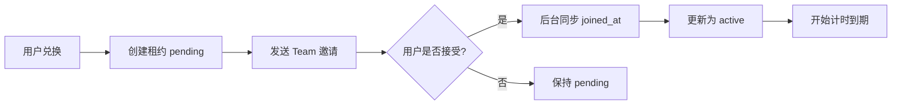
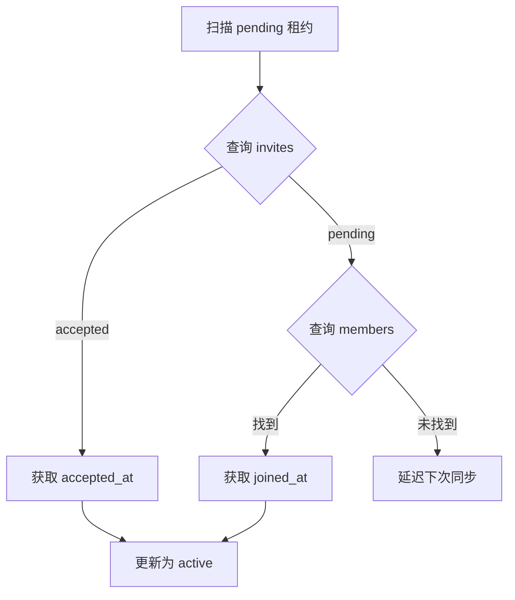
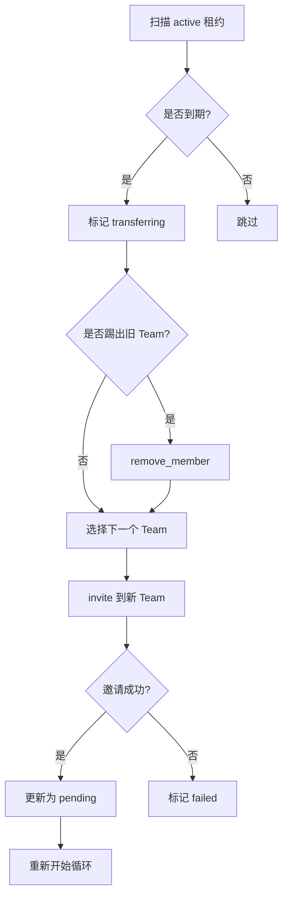

# 到期自动转移系统使用指南

## 目录
- [系统概述](#系统概述)
- [核心概念](#核心概念)
- [配置说明](#配置说明)
- [工作流程](#工作流程)
- [管理操作](#管理操作)
- [API 接口](#api-接口)
- [故障排查](#故障排查)

---

## 系统概述

到期自动转移系统会自动管理用户在不同 Team 之间的轮换,确保:
- 用户按月享受 Team 席位
- 租期公平(基于实际加入时间计算)
- 自动轮询到下一个 Team
- 完整的审计日志

### 架构组成

```
┌─────────────────────────────────────────────────────────┐
│                  到期自动转移系统                         │
├─────────────────────────────────────────────────────────┤
│                                                         │
│  lease_models.py         数据模型和状态机定义           │
│  join_sync_service.py    加入时间同步服务               │
│  transfer_executor.py    转移执行器                     │
│  transfer_scheduler.py   转移调度器(定时任务)           │
│  database.py             数据持久化层                   │
│                                                         │
└─────────────────────────────────────────────────────────┘
```

---

## 核心概念

### 1. 租约状态 (LeaseStatus)

| 状态 | 说明 | 是否计入到期 |
|------|------|------------|
| `pending` | 已发送邀请,等待用户接受 | 否 |
| `active` | 已加入,租期进行中 | 是 |
| `transferring` | 正在执行转移操作 | 否 |
| `failed` | 转移失败,需人工介入 | 否 |
| `cancelled` | 已取消(终态) | 否 |

**状态转换:**
```
pending → active → transferring → pending (循环)
   ↓         ↓           ↓
failed   cancelled   failed
```

### 2. 时间字段

| 字段 | 说明 | 示例 | 是否可变 |
|------|------|------|---------|
| `created_at` | 租约创建时间(兑换时间) | 2026-01-11 10:00:00 | ❌ 永不改变 |
| `invited_at` | 发送邀请时间 | 2026-01-11 10:00:05 | ✅ 转移时更新 |
| `joined_at` | 用户接受邀请时间 | 2026-01-12 14:30:00 | ✅ 同步时写入 |
| `expires_at` | 到期时间 | 2026-02-12 14:30:00 | ✅ 基于 joined_at 计算 |

**核心规则:**
- 到期时间 = `joined_at` + `AUTO_TRANSFER_TERM_MONTHS` 个月
- `created_at` 保留原始兑换时间,用于审计
- `joined_at` 为 NULL 时,租约保持 `pending` 状态

### 3. 完整流程时间线

```
用户兑换                同步加入            租期结束             转移到新 Team
   |                      |                   |                      |
   v                      v                   v                      v
created_at            joined_at          expires_at          invited_at(新)
(永久保留)          (后台自动同步)      (自动计算)         (重新开始循环)
   |                      |                   |                      |
2026-01-11           2026-01-12          2026-02-12           2026-02-12
10:00:00             14:30:00            14:30:00             15:00:00
   |                      |                   |                      |
pending              active              transferring           pending
```

---

## 配置说明

### 环境变量

在 `.env` 或系统环境变量中配置:

```bash
# ========== 自动转移功能开关 ==========
AUTO_TRANSFER_ENABLED=true                    # 启用自动转移 (默认: false)
AUTO_TRANSFER_POLL_SECONDS=300                # 检查间隔(秒) (默认: 300 = 5分钟)

# ========== 租期配置 ==========
AUTO_TRANSFER_TERM_MONTHS=1                   # 租期月数 (默认: 1, 范围: 1-24)

# ========== 转移策略 ==========
AUTO_TRANSFER_AUTO_LEAVE_OLD_TEAM=false       # 是否自动退出旧 Team (默认: false)
# 或使用别名:
AUTO_TRANSFER_KICK_OLD_TEAM=false

# ========== 加入时间同步 ==========
AUTO_TRANSFER_ALLOW_APPROX_JOIN_AT=false      # 允许近似加入时间 (默认: false)
# true: 如果成员列表无时间字段,用当前时间近似
# false: 严格要求精确的加入时间
```

### 配置示例

#### 场景1: 保守配置(推荐)
```bash
AUTO_TRANSFER_ENABLED=true
AUTO_TRANSFER_TERM_MONTHS=1
AUTO_TRANSFER_AUTO_LEAVE_OLD_TEAM=false
AUTO_TRANSFER_ALLOW_APPROX_JOIN_AT=false
```
- ✅ 1个月租期
- ✅ 用户需手动退出旧 Team
- ✅ 严格要求精确加入时间

#### 场景2: 激进配置
```bash
AUTO_TRANSFER_ENABLED=true
AUTO_TRANSFER_TERM_MONTHS=1
AUTO_TRANSFER_AUTO_LEAVE_OLD_TEAM=true
AUTO_TRANSFER_ALLOW_APPROX_JOIN_AT=true
```
- ⚠️ 自动踢出旧 Team (可能导致用户困惑)
- ⚠️ 允许近似时间 (到期计算不够精确)

---

## 工作流程

### 1. 用户兑换流程



**数据库记录:**
```sql
-- 兑换时
status = 'pending'
created_at = '2026-01-11 10:00:00'  -- 兑换时间
invited_at = '2026-01-11 10:00:00'  -- 邀请时间
joined_at = NULL                     -- 等待同步
expires_at = '2026-02-11 10:00:00'  -- 预估(不准确)

-- 用户接受邀请后(自动同步)
status = 'active'
joined_at = '2026-01-12 14:30:00'   -- 实际加入时间
expires_at = '2026-02-12 14:30:00'  -- 准确的到期时间
```

### 2. 加入时间同步流程

后台定时任务(`JoinSyncService`)会自动同步:



**同步策略:**
1. 优先从 `invites` API 获取 `accepted_at`
2. 如果没有,从 `members` API 获取 `joined_at`
3. 如果都没有:
   - `ALLOW_APPROX_JOIN_AT=true`: 使用当前时间近似
   - `ALLOW_APPROX_JOIN_AT=false`: 延迟重试,等待用户真正加入

### 3. 到期转移流程



**轮询策略:**
- 从当前 Team 的下一个开始
- 跳过当前 Team
- 按配置顺序轮询
- 检查席位是否可用

---

## 管理操作

### 1. 查看租约列表

**API:**
```bash
GET /api/admin/leases?limit=100&offset=0
```

**返回字段:**
```json
{
  "email": "user@example.com",
  "team_name": "Team A",
  "status": "active",
  "created_at": "2026-01-11 10:00:00",
  "invited_at": "2026-01-11 10:00:00",
  "joined_at": "2026-01-12 14:30:00",
  "expires_at": "2026-02-12 14:30:00",
  "transfer_count": 0,
  "attempts": 0,
  "last_error": null
}
```

### 2. 手动同步加入时间

**场景:** 用户已接受邀请,但状态仍为 `pending`

**API:**
```bash
POST /api/admin/leases/sync-joined
{
  "limit": 50  # 批量同步数量
}
```

**或单个邮箱:**
```bash
POST /api/admin/lease/sync-joined
{
  "email": "user@example.com"
}
```

### 3. 手动触发转移

**场景:** 测试转移功能,或提前转移某个用户

**API:**
```bash
POST /api/admin/lease/transfer
{
  "email": "user@example.com"
}
```

**返回:**
```json
{
  "success": true,
  "moved": 1,
  "message": "已发送新 Team 邀请（请看事件）"
}
```

### 4. 删除租约(新功能)

**场景:** 误添加的邮箱,需要删除

**API:**
```bash
POST /api/admin/leases/delete
{
  "email": "wrong@example.com"
}
```

**注意事项:**
- ⚠️ 删除操作不可恢复
- ✅ 会记录删除事件到 `member_lease_events`
- ✅ 用户的兑换记录不受影响,只删除转移租约

### 5. 查看事件日志

**API:**
```bash
GET /api/admin/lease/events?email=user@example.com&limit=100
```

**事件类型:**
- `created`: 租约创建
- `joined`: 检测到加入
- `transferred`: 转移成功
- `transfer_failed`: 转移失败
- `deleted`: 租约删除
- `sync_*`: 各种同步事件

### 6. 强制到期(测试用)

**API:**
```bash
POST /api/admin/leases/force-expire
{
  "email": "test@example.com"
}
```

---

## API 接口

### 租约管理

| 接口 | 方法 | 说明 |
|------|------|------|
| `/api/admin/leases` | GET | 查看租约列表 |
| `/api/admin/leases/delete` | POST | 删除租约 |
| `/api/admin/leases/force-expire` | POST | 强制到期(测试) |
| `/api/admin/lease/sync-joined` | POST | 同步单个加入时间 |
| `/api/admin/lease/transfer` | POST | 手动触发转移 |
| `/api/admin/lease/events` | GET | 查看事件日志 |
| `/api/admin/leases/sync-joined` | POST | 批量同步加入时间 |

### 请求示例

```bash
# 查看所有 pending 的租约
curl http://localhost:8000/api/admin/leases?limit=100

# 删除误添加的租约
curl -X POST http://localhost:8000/api/admin/leases/delete \
  -H "Content-Type: application/json" \
  -d '{"email": "wrong@example.com"}'

# 手动同步加入时间
curl -X POST http://localhost:8000/api/admin/leases/sync-joined \
  -H "Content-Type: application/json" \
  -d '{"limit": 50}'

# 查看某个用户的事件
curl http://localhost:8000/api/admin/lease/events?email=user@example.com
```

---

## 故障排查

### 问题1: 用户一直是 pending 状态

**症状:** 用户已接受邀请,但 `status` 仍为 `pending`

**排查步骤:**
1. 检查事件日志:
   ```bash
   GET /api/admin/lease/events?email=user@example.com
   ```

2. 查看最新事件:
   - `sync_invite_status`: 邀请状态不是 accepted
   - `sync_member_no_time`: 成员列表无时间字段
   - `sync_not_joined`: 未找到加入证据

3. 解决方案:
   ```bash
   # 方案1: 手动同步
   POST /api/admin/lease/sync-joined
   {"email": "user@example.com"}

   # 方案2: 允许近似时间
   # 在 .env 中设置:
   AUTO_TRANSFER_ALLOW_APPROX_JOIN_AT=true
   ```

### 问题2: 转移失败

**症状:** `status = failed`, `last_error` 有错误信息

**常见原因:**
1. **无可用席位**
   - 检查: 所有 Team 的席位都满了
   - 解决: 增加 Team 数量或席位

2. **邀请失败**
   - 检查: `auth_token` 是否过期
   - 解决: 更新 Team 配置中的 token

3. **踢出旧 Team 失败**
   - 检查: `AUTO_TRANSFER_AUTO_LEAVE_OLD_TEAM=true` 但权限不足
   - 解决: 检查 token 权限,或改为 `false` 让用户手动退出

### 问题3: 到期时间不准确

**症状:** 用户实际使用时间和配置的月数不符

**原因:** `joined_at` 晚于 `created_at`

**检查:**
```sql
SELECT
  email,
  created_at,
  joined_at,
  expires_at,
  ROUND((JULIANDAY(expires_at) - JULIANDAY(joined_at)), 1) as actual_days
FROM member_leases
WHERE email = 'user@example.com';
```

**预期:** `actual_days` ≈ 30 (如果 TERM_MONTHS=1)

**修复:** 无需修复,这是预期行为。重构后的系统确保:
- 到期时间 = `joined_at` + N 个月
- 用户实际使用时间公平

### 问题4: 后台任务没有运行

**检查:**
```bash
# 1. 查看日志
tail -f /var/log/your-app.log

# 2. 检查环境变量
echo $AUTO_TRANSFER_ENABLED

# 3. 检查线程状态
# 如果看到这条日志,说明已启动:
# "自动转移线程已启动（每 300s 检查一次）"
```

**解决:**
```bash
# 确保设置了:
AUTO_TRANSFER_ENABLED=true
```

---

## 最佳实践

### 1. 监控建议

定期检查:
- `failed` 状态的租约数量
- `pending` 且超过 3 天的租约
- 转移失败率 (events 表中 `transfer_failed` 的数量)

### 2. 容量规划

**Team 数量计算:**
```
最小 Team 数 = ceil(总用户数 / 每个 Team 席位数) + 1
```

**示例:**
- 100 个用户
- 每个 Team 5 个席位
- 最小 Team 数 = ceil(100/5) + 1 = 21 个 Team

**+1 的原因:** 转移时需要有空余 Team

### 3. 迁移旧数据

如果从旧系统迁移:
```sql
-- 1. 检查旧数据
SELECT COUNT(*) FROM member_leases WHERE status = 'awaiting_join';

-- 2. 自动迁移已运行(在 database.py 的 init 中)
-- awaiting_join → pending
-- awaiting_transfer → failed

-- 3. 手动触发同步
POST /api/admin/leases/sync-joined
{"limit": 1000}
```

---

## 权限控制

### 谁会获得自动转移权限?

**默认行为:** 兑换码的 `auto_transfer_enabled` 字段控制是否为用户创建租约。

| 字段值 | 行为 | 适用场景 |
|--------|------|---------|
| `1` (默认) | 创建租约,参与自动转移 | 普通用户,按月轮换 |
| `0` | 不创建租约,永久使用 | VIP 用户,特殊权限 |

### 权限控制层级

系统有 **3 层权限控制**:

#### 1. 全局开关 (环境变量)
```bash
AUTO_TRANSFER_ENABLED=true   # 启用/关闭整个自动转移功能
```
- ✅ 影响范围: 所有租约
- ⚠️ 关闭后,所有租约都不会自动转移

#### 2. 兑换码级别控制 (数据库字段)
```sql
-- 创建支持自动转移的兑换码(默认)
INSERT INTO redemption_codes (code, team_name, auto_transfer_enabled)
VALUES ('NORMAL123', 'Team A', 1);

-- 创建不支持自动转移的兑换码(VIP 用户)
INSERT INTO redemption_codes (code, team_name, auto_transfer_enabled)
VALUES ('VIP456', 'Team A', 0);
```
- ✅ 影响范围: 该兑换码的所有用户
- ✅ 适用场景: 区分普通用户和 VIP 用户

#### 3. 用户级别控制 (删除租约)
```bash
# 手动删除某个用户的租约(永久退出自动转移)
POST /api/admin/leases/delete
{"email": "user@example.com"}
```
- ✅ 影响范围: 单个用户
- ✅ 适用场景: 用户主动退出自动转移

### 如何创建不同类型的兑换码?

**Web 界面创建兑换码时:**
- 添加 "启用自动转移" 选项(默认勾选)
- 取消勾选 = VIP 用户,永久使用

**API 创建兑换码时:**
```bash
# 普通用户兑换码(默认)
POST /api/admin/codes/create
{
  "code": "NORMAL123",
  "team_name": "Team A",
  "auto_transfer_enabled": true
}

# VIP 用户兑换码(永久使用)
POST /api/admin/codes/create
{
  "code": "VIP456",
  "team_name": "Team A",
  "auto_transfer_enabled": false
}
```

### 兼容性说明

- ✅ **旧数据兼容**: 已存在的兑换码默认 `auto_transfer_enabled=1`
- ✅ **旧租约不受影响**: 已创建的租约继续正常转移
- ✅ **向后兼容**: 不指定该字段时,默认启用自动转移

---

## 总结

### 核心原则

1. **时间分离**: `created_at` (审计) vs `joined_at` (计时)
2. **状态清晰**: `pending` → `active` → `transferring`
3. **自动化**: 后台定时任务,无需人工干预
4. **可控性**: 丰富的 API 支持手动操作

### 关键配置

```bash
# 最小配置
AUTO_TRANSFER_ENABLED=true
AUTO_TRANSFER_TERM_MONTHS=1

# 推荐配置
AUTO_TRANSFER_ENABLED=true
AUTO_TRANSFER_TERM_MONTHS=1
AUTO_TRANSFER_AUTO_LEAVE_OLD_TEAM=false
AUTO_TRANSFER_ALLOW_APPROX_JOIN_AT=false
```

### 常用操作

```bash
# 查看租约
GET /api/admin/leases

# 删除误添加的租约
POST /api/admin/leases/delete
{"email": "wrong@example.com"}

# 手动同步
POST /api/admin/leases/sync-joined
{"limit": 50}

# 查看事件
GET /api/admin/lease/events?email=user@example.com
```

---

如有问题,请查看:
- [REFACTORING_SUMMARY.md](REFACTORING_SUMMARY.md) - 重构总结
- [AUTO_TRANSFER_FLOW.md](AUTO_TRANSFER_FLOW.md) - 原始设计文档
